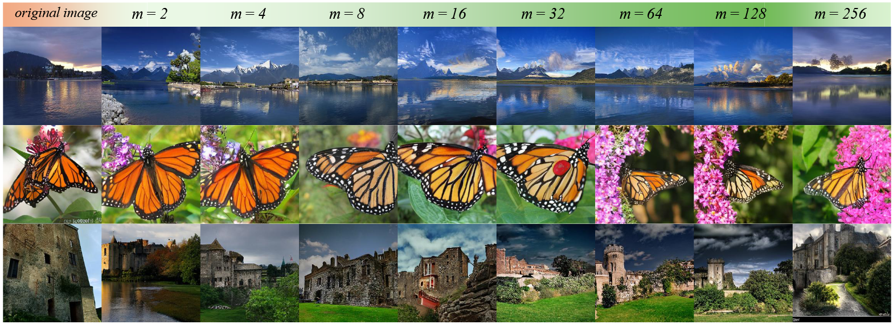
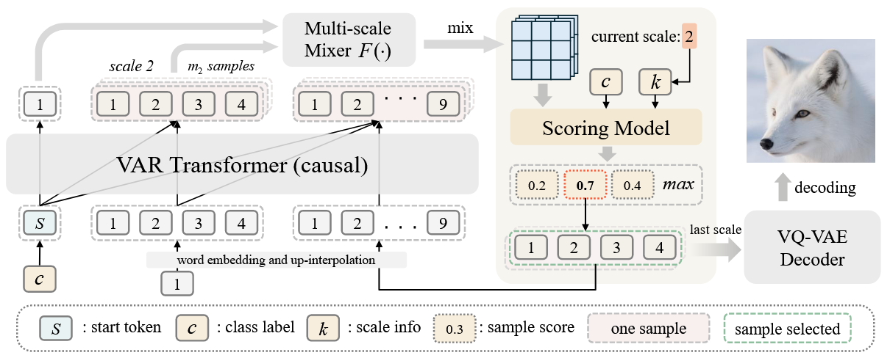
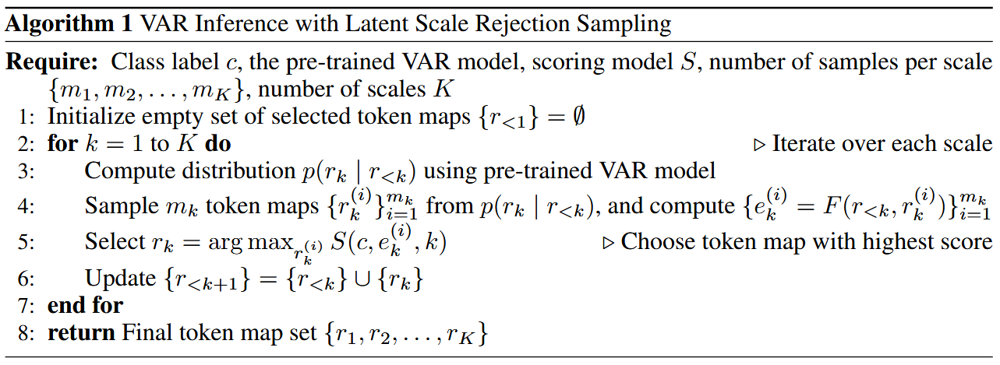

<div align="center">

# LSRS: Latent Scale Rejection Sampling for Visual Autoregressive Modeling

[](https://arxiv.org/abs/2512.03796) [](https://www.python.org/downloads/release/python-380/) [](LICENSE)

*A highly efficient test-time scaling strategy for Visual Autoregressive (VAR) image generation*



</div>

---

## 📑 Table of Contents

- [Introduction](#-introduction)
- [How LSRS Works](#-how-lsrs-works)
- [Performance](#-performance)
- [Getting Started](#-getting-started)
  - [Environment Setup](#environment-setup)
  - [Download Checkpoints](#download-checkpoints)
- [Training](#-training-the-scoring-model)
- [Inference](#-inference-with-lsrs)
- [Evaluation](#-evaluation)
- [Model Zoo](#-model-zoo)
- [File Description](#-file-description)
- [Citation](#-citation)

---

## 💡 Introduction

We propose **Latent Scale Rejection Sampling (LSRS)** to improve Visual Autoregressive (VAR) image generation. LSRS uses a lightweight scoring model to reject suboptimal token maps during inference, effectively fixing structural errors.

> 🚀 On VAR-*d*30, LSRS reduces the FID score from **1.95 → 1.78** with merely **1%** extra inference time, and to **1.66** with a **15%** increase!

---

## 🔍 How LSRS Works

<div align="center">

<p><i>An illustration of LSRS applied during VAR inference</i></p>
</div>

<div align="center">

<p><i>Algorithm: VAR Inference with Latent Scale Rejection Sampling</i></p>
</div>

---

## 📊 Performance

| Model | FID↓ | IS↑ | Pre↑ | Rec↑ | Param | Step | Time |
|:------|:----:|:---:|:----:|:----:|:-----:|:----:|:----:|
| VAR-*d*16 | 3.36 | 274.5 | 0.84 | 0.51 | 310M | 10 | 0.20 |
| + LSRS *M*=4 | 3.19 | 278.1 | 0.82 | 0.54 | 310M+4M | 10 | 0.21 |
| + LSRS *M*=128 | **2.97** | 276.4 | 0.81 | 0.55 | 310M+4M | 10 | 0.30 |
| VAR-*d*30 | 1.95 | 303.1 | 0.82 | 0.59 | 2.0B | 10 | 1.00 |
| + LSRS *M*=4 | 1.78 | 305.9 | 0.81 | 0.61 | 2.0B+4M | 10 | 1.01 |
| + LSRS *M*=128 | **1.66** | 298.9 | 0.80 | 0.63 | 2.0B+4M | 10 | 1.15 |

---

## 🚀 Getting Started

### Environment Setup

```bash
conda create -n lsrs python=3.8 -y
conda activate lsrs
pip install -r requirements.txt
```

### Download Checkpoints

Download pre-trained VAE and VAR weights from the [official VAR repository](https://github.com/FoundationVision/VAR).

```
var_ckpt_folder/
├── var_d16.pth
├── var_d20.pth
├── var_d24.pth
└── var_d30.pth
```

---

## 🏋️ Training the Scoring Model

### 1️⃣ Configuration

Modify `configs.py` as needed, especially:
- `vae_ckpt`
- `var_ckpt_folder`
- `data_path`

### 2️⃣ Prepare Dataset

**Convert ImageNet training set:**
```bash
CUDA_VISIBLE_DEVICES=0 python data_imagenet.py
```

**Sample data using VAR:**
```bash
CUDA_VISIBLE_DEVICES=0 python data_var.py --batch_size 25 --model_depth 16
```

### 3️⃣ Train the Model

```bash
CUDA_VISIBLE_DEVICES=0 python train_score.py --d 30
```

---

## 🎯 Inference with LSRS

**Original VAR:**
```bash
CUDA_VISIBLE_DEVICES=0 python sample_lsrs.py -b 25 -d 30
```

**With LSRS:**
```bash
CUDA_VISIBLE_DEVICES=0 python sample_lsrs.py -b 25 -d 30 -u -s ./scoring_model.pth --st 1 --ed 2 --mk 32
```

> ⚠️ **Note:** Scale indices range from 0 to 9, corresponding to 1 to 10 in the paper.

---

## 📈 Evaluation

The generated `.npz` files are saved in `path_lsrs_sample_output`. Use [OpenAI's FID evaluation toolkit](https://github.com/openai/guided-diffusion/tree/main/evaluations) with the [256×256 reference](https://openaipublic.blob.core.windows.net/diffusion/jul-2021/ref_batches/imagenet/256/VIRTUAL_imagenet256_labeled.npz) to evaluate FID, IS, precision, and recall.

---

## 🗂️ Model Zoo

> 🔜 **Coming Soon!** Pre-trained scoring models will be available for direct download.

---

## 📁 Core Files

### New Files of LSRS

| File | Description |
|:-----|:------------|
| `configs.py` | Configuration for paths and hyperparameters |
| `data_imagenet.py` | Convert ImageNet dataset to training format |
| `data_var.py` | Sample training data using VAR model |
| `train_score.py` | Training script with ranking loss |
| `score_net.py` | PyTorch implementation of scoring model |
| `load_score_models.py` | Load scoring models for inference |
| `sample_lsrs.py` | Sample 50,000 images for evaluation |

### Modified Files from VAR

| File | Modification |
|:-----|:-------------|
| `__init__.py` | Added `build_vae` function for VQVAE construction |
| `var.py` | Added `autoregressive_infer_cfg_idx` and `autoregressive_infer_cfg_lsrs` classes |
| `quant.py` | Added `get_next_autoregressive_input_lsrs`, `_get_best_candidate`, `idxBl_to_fhat` |

---

## 🙏 Acknowledgement

Thanks to [VAR](https://github.com/FoundationVision/VAR) for their wonderful work and codebase!

---

## 📝 Citation

If you find this work useful, please cite:

```bibtex
@article{zheng2025lsrs,
  title={LSRS: Latent Scale Rejection Sampling for Visual Autoregressive Modeling},
  author={Zheng, Hong-Kai and Li, Piji},
  journal={arXiv preprint arXiv:2512.03796},
  year={2025}
}
```

---

<div align="center">
<i>If you have any questions, feel free to open an issue!</i>
</div>